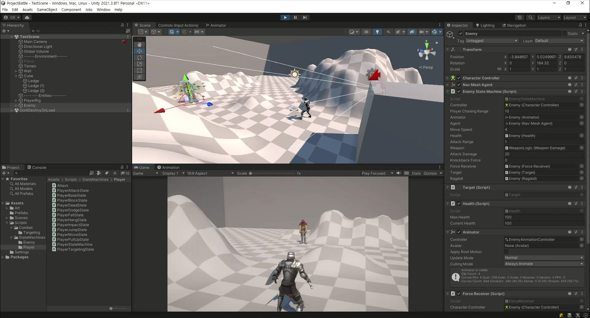
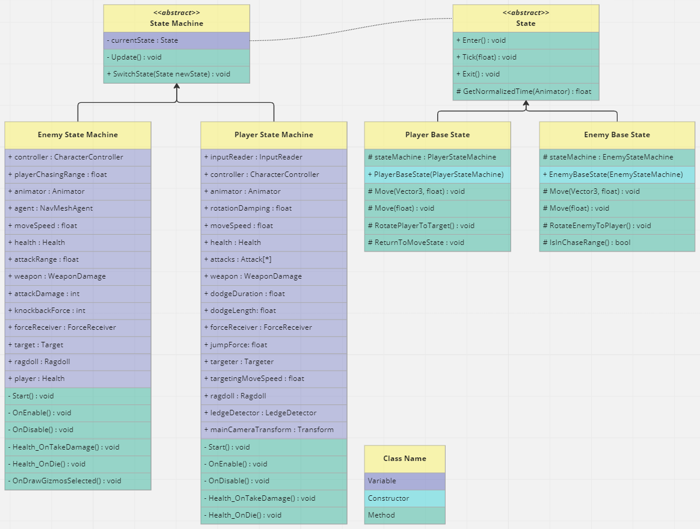
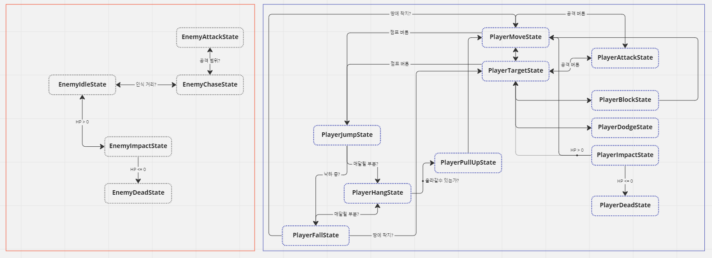

# Unity : TPS Combat

## State Machine

객체의 행동 및 상태를 기반으로 정의하여, 전이 조건에 따라 다른 행동을 할 때 유용하게 사용할 수 있는 디자인 패턴.

## New Input System

기존 인풋 시스템 대신 크로스 플랫폼으로 편리하게 확장 가능한 방식.

## Resources from...
* [Mixamo](https://mixamo.com)
  * Character
    * Paladin_J_Nordstrom
    * Knight_D_Pelegrini
  * Locomotion pack-12 animation set
  * Attack Animation for Player
    * Standing Melee Attack Downward
    * Standing Melee Attack Backhand
    * Standing Melee Attack 360 Low
  * Attack Animation for Enemy
    * Hook Punch
  * Dodge Animation for Player
    * Standing Dodge Forward
    * Standing Dodge Backward
    * Standing Dodge Right
    * Standing Dodge Left
  * Climb Animation for Player
    * Hanging Idle
    * Freehang Climb
  * ETC
    * Great Sword Head `Impact`
    * Sword and Shield `Block` Idle

## Reference
* https://blog.unity.com/technology/introducing-the-new-input-system
* https://github.com/UnityTechnologies/InputSystem_Warriors
* https://medium.com/codex/why-you-should-use-unitys-new-input-system-268773863c4