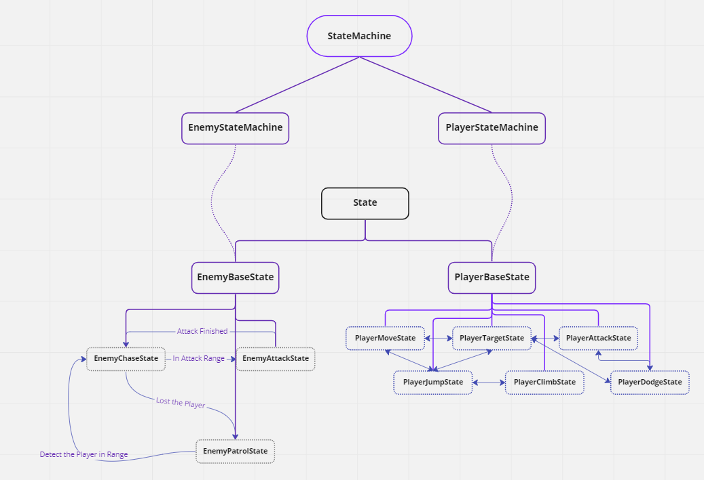
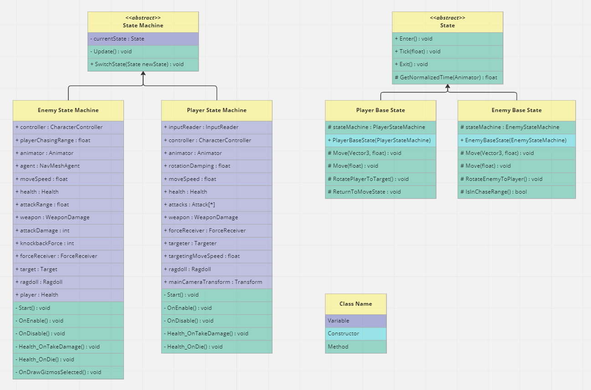
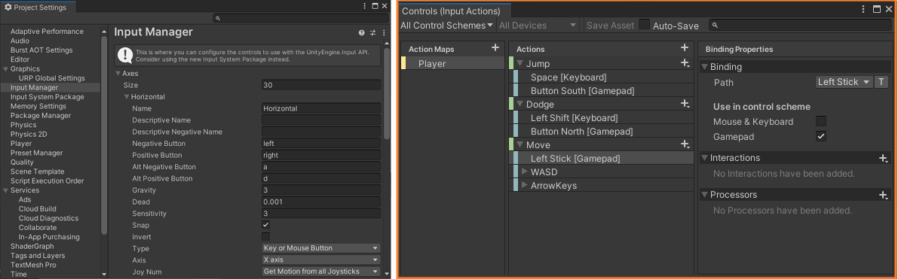

## State Machine

## New Input System

## Resources from...
* ~~[Sketchfab](https://skfb.ly/ovEKG)~~
* [Mixamo](https://mixamo.com)
  * Character
    * Paladin_J_Nordstrom
    * Knight_D_Pelegrini
  * Locomotion pack-12 animation set
  * Attack Animation for Player
    * Standing Melee Attack Downward
    * Standing Melee Attack Backhand
    * Standing Melee Attack 360 Low
  * Attack Animation for Enemy
    * Hook Punch
  * ETC
    * Great Sword Head `Impact`
    * Sword and Shield `Block` Idle

## Reference
* https://blog.unity.com/technology/introducing-the-new-input-system
* https://github.com/UnityTechnologies/InputSystem_Warriors
* https://medium.com/codex/why-you-should-use-unitys-new-input-system-268773863c4